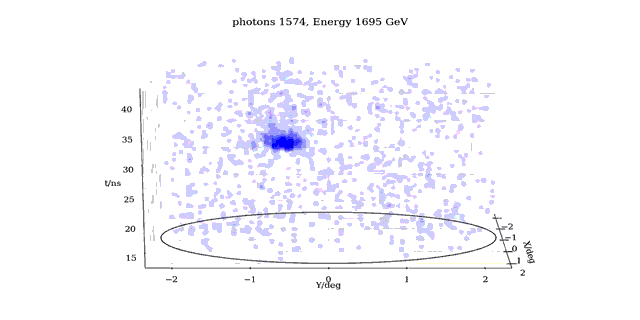
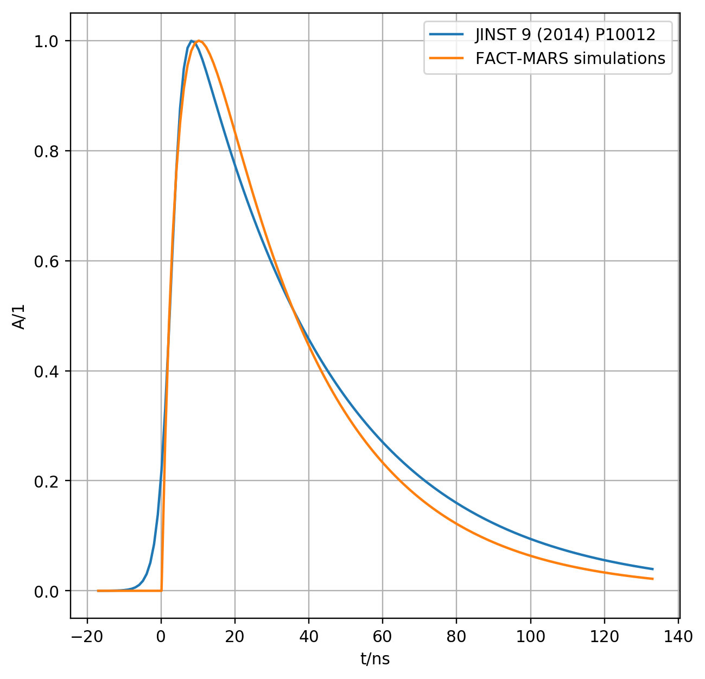

# Photon-Stream [](https://travis-ci.org/fact-project/photon_stream)


Representing Imaging Atmospheric Cherenkov Telescope (IACT) events using single photons.

 - [All FACT events (observations and simulations)](https://ihp-pc41.ethz.ch/public/phs/)
 - [White Paper ICRC2017](https://pos.sissa.it/301/801/pdf)
 - [Video presentation](https://www.youtube.com/watch?v=F0C2tcj1rb8)
 - [C++ reader and writer](https://github.com/fact-project/photon_stream_cpp)

The events of [FACT](http://www.fact-project.org/) can be represented as a list of lists of arrival times of individual night-sky-background and air-shower photons. We call this list of lists the photon-stream.
This python package collects tools to produce, visualize and analyze photon-stream (phs) events. The photon-stream is based on our [single photon extractor](https://github.com/fact-project/single_photon_extractor) for Silicon Photo Multipliers (SiPMs).

## Install
```bash
pip install git+https://github.com/fact-project/photon_stream
```

## Usage
```python
import photon_stream as ps
import matplotlib.pyplot as plt

reader = ps.EventListReader('20151001_011.phs.jsonl.gz')
event = next(reader)

ps.plot.event(event)
plt.show()
```
Read in the full CORSIKA simulation truth and estimate instrument response functions:
```python
import photon_stream as ps
import pandas as pd

sim_reader = ps.SimulationReader(
    photon_stream_path='tests/resources/011014.phs.jsonl.gz',
    mmcs_corsika_path='tests/resources/011014.ch'
)

for event in sim_reader:
    # process event ...
    # extract Hillas and other features ....
    # do deep learning ...
    pass

thrown_events = pd.DataFrame(sim_reader.thrown_events())
```

# Rationale
As a technology demonstrator, the FACT telescope records its observations in a format which is close to the read out hardware. This was a great choice to explore the novel SiPM and DRS4 readout chain, but turns out to be tedious to do  astronomy as the raw events are rather bulky, full of artifacts and not calibrated. The raw events are ```1440``` pixels X  ```300``` time slices X ```16```bit dynamic range = 864kB in size. The raw events can not be analyzed independent of each other (readout artifacts) and further need additional calibration files, which are not straight forward to identify. Although effort was spent to compress the raw events with our dedicated [zfits](https://arxiv.org/pdf/1506.06045.pdf) format, the events from 2011 to 2017 still need >500TB of disk storage. The years passed by and FACT is not longer a demonstrator, but a part of the high energy gamma-ray astronomy community. It is time to access and analyze our observations in an easier way. It is time for a physics format.

The photon-stream can compress FACT events down to a size of 2.7kB for dark nights. Based on this, the idea was born to create a no compromise, physics only file format with the potential to fit all events of FACT onto a single hard disk drive of 10TB.
The photon-stream format is already calibrated and thus does not need additional files to be interpreted. Known instrument artifacts have been removed from the photon-stream and the events are now independent of each other.

The photon-stream format is intended to do __astronomy__. We believe that astronomy can only proceed when access to the observations is easy. We want to enable a Bachelor student to analyze years of FACT observations on her notebook! We want to enable students to transfer 5 min of FACT observations via email. We want to give students something that they are familiar with, i.e. the concept of single photons. Everybody knows single photons. But only established IACT experts knows the concept of 'main-pulses' which carry photon equivalents, know readout calibration and artifact mayhem. We want to keep the air-shower physics and even gain additional timing knowledge which was not accessible with the established 'main-pulse' representation which is still a heritage of our PMT based ancestors. Finally, we want to reveal, for the first time ever, the true potential of an SiPM based IACT. This is the photon-stream.

# Storage
We offer two storage formats. First the [Json](https://www.json.org/)-Lines format, and second a dedicated binary format. Json-Lines is excellent to share data with colleagues or new students. Json is human readable and fortunately surprisingly efficient to store the photon-stream. Many programming languages can read and write Json.
Our dedicated binary format ```phs``` is fast to read and write, and it is only about 2/3 of the Json size.

## Json-Lines
[Json](https://www.json.org/)-Lines is a text file where each line is a valid Json object. Json turned out to store our photon-stream efficiently. Here we see one example event:
```json
{"Night":20170119,"Run":229,"Event":1,"UnixTime_s_us":[1484895178,532244],"Trigger":4,"Az_deg":-63.253664797474336,"Zd_deg":33.06900475126648,"PhotonArrivals_500ps":[[59,84],[102,93,103],[58],[65,79,97],[],[125,43,68],[102],[68,100,123],[52,52,79,113,61,78,112,87]],"SaturatedPixels":[]}
```
Json-Lines run files are named ```YYYYmmnn_RRR.phs.jsonl.gz```. There is no run header. Each line in a ```phs.jsonl.gz``` file corresponds to one event. This way events can be concatenated and counted very easily.

### Keys

```json
"Night":YYYYmmnn
```
The FACT night integer. Here ```YYYY``` is the year A.D., ```mm``` is the month, and ```nn``` is the night of the observation. A night is different from a day. The night integer increases to the next night during ```12:00 UTC``` o'clock rather than ```00:00 UTC```. The night integer is always 8 digits, e.g. ```20170201``` which is first of February 2017.

```json
"Run":RRR
```
The unique run identifier of a night. The observations of a night are split into runs of usually ```5 minutes```. Since not all runs are observation runs, but e.g. calibration runs, the run identifiers in the high level photon-stream format are not necessary continuous, since calibration runs are missing. The run integer in the file name is always 3 digits, e.g. ```20170201_021.phs.jsonl.gz``` is the twenty first run of the first night in February 2017.

```json
"Event":eee
```
The event identifier of a run. In a run, the individual events have unique identifiers. The event integer is not fixed in its length e.g. ```"Event":4``` is the fourth event in a run, and ```"Event":34845``` is the thirty-four-thousands-and-eight-hundreds-forty-fifth event in a run.

```json
"UnixTime_s_us":[1484895178,532244]
```
The moment when the event was recorded in unix time (keep in mind that unix time has leap seconds!). The first entry in the the array are the unix time seconds ```s```, and the second entry are the additional micro seconds ```us```.
```c++
double event_time = 1484895178.0 + 1e-6 * 532244.0
```
The time stamp is out of the FACT event builder program and can be off the actual trigger time by about ```30ms```. For high precision timing in the ```5us``` range, the GPS time is needed, which unfortunately is not yet available.

```json
"Trigger":xxxx
```
The trigger type of the FACT telescope. There are different trigger types for FACT, here in the high level format we only have left:

- 4: The self triggered mode, also called "physics trigger". These events are expected to contain light flashes and air showers.
- 1: External trigger input 1. Here the GPS module triggers the read out ```59``` times a minute. These events are expected to contain only night-sky-background.
- 2: External trigger input 2. The same as external trigger input 1, since the GPS module was switched from 1 to 2 once.
- 1024: A random trigger also called "pedestal trigger". These events are also expected to only contain night-sky-background.

For a full overview of the FACT trigger types, see the [Phd of Patrick Vogler, table 4.3.b](http://e-collection.library.ethz.ch/eserv/eth:48381/eth-48381-02.pdf)

```json
"Az_deg":-63.253664797474336,"Zd_deg":33.06900475126648
```
The pointing direction of the FACT telescope in the moment the event was recorded. This is reconstructed from the ```aux``` (auxiliary) drive files based on the event time.  ```"Az_deg"``` is the azimuth pointing in degrees, and ```"Zd_deg"``` is the zenith distance pointing in degrees.

```json
"PhotonArrivals_500ps":[[],[],[]]
```
The actual photon-stream. A list of lists of arrival times of photons in units of ```500ps```.
The outer list loops over all ```1440``` pixels of FACT and is ordered in ```Continuous  Hardware ID (CHID)```. The inner lists loop over the arrival times of the individual photons for the corresponding pixel. The maximum number of photons in a pixel before the extraction of photons is aborted is ```500```. If there are ```500``` photons in a pixel, this pixel is saturated and meaningless.
Since a single photon is now defined by only one sharp arrival time in contrast to a very long pulse, there is no need anymore to stick to a long region of interest in time and therefore the output of the photon-stream is truncated only to the region where the air-shower physics takes place, which is from ```15ns``` to ```65ns``` (I hardly ever saw air shower events beyond ```45ns```) on FACT's raw ROI of ```150ns```. So each event has an exposure time of ```50ns```. If you have any uncomfortable feelings about this truncation then let me remind you of the physics results which come out of the MAGIC telescope with its ROI of ```30ns``` and only ```625ps``` sampling.

```json
"SaturatedPixels":[123,456]
```
A list of pixels in ```CHID``` to indicate that the corresponding pixel had an saturated analog time line out of the raw DRS4 chip. The maximum number of saturated pixels is ```100```, as the event is skipped then anyhow. Usually this list is empty. Such saturations happen not only for ultra high energy air showers, but also when the DRS4 calibration was not possible or is broken elseway.

## Dedicated binary format
The ```phs``` format is a binary format with exactly the same content as the Json-Lines ```phs.jsonl``` format.
There is no run header of footer. This is just a list of events.
Binary run files are named ```YYYYmmnn_RRR.phs.gz```.

The content of the different event types is as follows:

## Observation Event
    - Descriptor
    - Observation Event Identifier
    - Observation Information
    - Pointing
    - Photon-Stream
    - Saturated Pixels


## Simulation Event
    - Descriptor
    - Simulation Event Identifier
    - Pointing
    - Photon-Stream
    - Saturated Pixels


### Descriptor (5 Byte)
    char
    +--------+--------+--------+
    |    p   |    h   |    s   |
    +--------+--------+--------+
    - A magic descriptor 'phs'

    uint8
    +--------+
    |VERSION |
    +--------+
    - VERSION == 4 is pass4

    uint8
    +--------+
    |  Type  |
    +--------+
    - Type == 0 is Observation
    - Type == 1 is Simulation


### Observation Event Identifier (12 Byte)

    uint32
    +--------+--------+--------+--------+
    |              Night Id             |
    +--------+--------+--------+--------+

    uint32
    +--------+--------+--------+--------+
    |               Run Id              |
    +--------+--------+--------+--------+

    uint32
    +--------+--------+--------+--------+
    |             Event Id              |
    +--------+--------+--------+--------+

### Simulation Event Identifier (12 Byte)

    uint32
    +--------+--------+--------+--------+
    |           CORSIKA RUN Id          |
    +--------+--------+--------+--------+

    uint32
    +--------+--------+--------+--------+
    |         CORSIKA EVENT Id          |
    +--------+--------+--------+--------+

    uint32
    +--------+--------+--------+--------+
    |      CORSIKA Event Reuse Id       |
    +--------+--------+--------+--------+

### Pointing (8 Byte)

    float32
    +--------+--------+--------+--------+
    |       Zenith Distance [Deg]       |
    +--------+--------+--------+--------+

    float32
    +--------+--------+--------+--------+
    |         Azimuth  [Deg]            |
    +--------+--------+--------+--------+


### Observation Information (12 Byte)

    uint32
    +--------+--------+--------+--------+
    |          UNIX time [s]            |
    +--------+--------+--------+--------+

    uint32
    +--------+--------+--------+--------+
    |      UNIX time [us] mod. [s]      |
    +--------+--------+--------+--------+

    uint32
    +--------+--------+--------+--------+
    |            Trigger type           |
    +--------+--------+--------+--------+


### Photon-Stream  (number photons + number pixel Byte)
The arrival time slice for a single photon is between 0 (0ns) and 100 (50ns) and thus fits comfortably into a single unsigned integer of eight bits width (```uint8```). A list of ```uint8``` is a valid list of arrival times for the photons found in a single pixel. To separate the photon arrival time lists of the individual pixels, we introduce a dedicated next-pixel-symbol which is not a valid photon arrival slice i.e. the digit ```255```. The concept of a list of symbols separated from the next list by a dedicated symbol is very common to [store digital text](https://en.wikipedia.org/wiki/Newline).

    uint32
    +--------+--------+--------+--------+
    |  Number of pixels plus photons    |
    +--------+--------+--------+--------+
    The size of the photon-stream in bytes.


    Photon arrival times in slices
    EXAMPLE. The actual shape and structure depend on the specific event.

         uint8
         +--------+--------+--------+--------+
       0 |     A  |     B  |     C  |   255  | <- Pixel CHID=0, 3 photons, arrival slices A, B, and C.
         +--------+--------+--------+--------+
       1 |   XXX  |   XXX  |   255  |
         +--------+--------+--------+
       2 |     C  |   255  | <- Pixel CHID=2, 1 photons, arriving in slice C.
         +--------+--------+--------+--------+--------+
       3 |   XXX  |   XXX  |   XXX  |   XXX  |   255  |
         +--------+--------+--------+--------+--------+--------+--------+
       4 |   XXX  |   XXX  |   XXX  |   XXX  |   XXX  |   XXX  |   255  |
         +--------+--------+--------+--------+--------+--------+--------+
       5 |   XXX  |   255  |
         +--------+--------+
       6 |   255  | <- Pixel CHID=6, 0 photons, empty.
         +--------+--------+--------+
       7 |   XXX  |   XXX  |   255  |
         +--------+--------+--------+
       .
       .
       .
         +--------+--------+
    1437 |   XXX  |   255  |
         +--------+--------+--------+--------+--------+
    1438 |   XXX  |   XXX  |   XXX  |   XXX  |   255  |
         +--------+--------+--------+--------+--------+
    1439 |     D  |     E  |   255  | <- last pixel CHID=1439, 2 photons at slices D and E.
         +--------+--------+--------+
    Pixel
    CHID

A list of lists of photon arrival time slices in CHID pixel order.
The line break from one pixel to the next pixel is marked by the line break
symbol 2^8-1 = ```255```. This leaves 255 (0-254) slices to encode photon arrival times.

### Saturated Pixels (2 + 2*number saturated pixel Byte)

    uint16
    +--------+--------+
    |        N        |
    +--------+--------+
    Number of saturated pixels

    uint16
    +--------+--------+--------+--------+     +--------+--------+
    |      CHID 0     |      CHID 1     | ... |      CHID N-1   |
    +--------+--------+--------+--------+     +--------+--------+
    A list of CHIDs of saturated pixels


# Memory representations
Depending on the computational task, the information in the photon-stream can be represented in different ways in memory which can ease the processing. These different representations can be converted into each other without information losses.

## List-of-lists
The list-of-lists in-memory representation is an outer list of all pixels (CHID ordering) that loops over the extracted arrival time lists for each pixel. The list-of-lists in-memory representation is the most compact one. We use the list-of-lists in-memory representation for permanent storage.

## Image-sequence
A two dimensional histogram along the the arrival time slices and the pixel directions. Each bin counts the number of single photons arriving at its corresponding pixel and corresponding arrival time slice. The image-sequence in-memory representation is suitable when a fixed event size is preferred. The histogram is always the same size in memory regardless of the number or structure of the photons. Slicing and integrating along the time axis can produce classic images with one intensity for each pixel.

## Point-cloud
A list of three dimensional direction and time coordinates of all photons in the stream of an event. Two of the three dimensions describe the angular incoming direction of a photon, which correspond to a specific pixel. The third dimension is the arrival time of the photon. This point-cloud in-memory representation is ideal for plotting the 3D point cloud, or to perform the density based clustering to tell apart air-shower photons from night-sky-background photons. The term point-cloud was chosen because of a large community working on exactly such data structures, e.g.  [Point Cloud Library (PCL)](http://pointclouds.org/).

# Known Limitations and outlook
The photon-stream ```pass4``` was created based on best effort. However, we are aware of a few shortcomings which might be addressed in future passes. Here is a list of possible improvements for the future in no particular order.

### Arrival time ordering
The List-of-list representations of photon-stream ```pass4``` store the arrival times of the individual photons in the order of their extraction. This ordering information was not found to be of any use yet. If it was of any use it would mean that our single pulse extractor is not optimal as we know that all relevant information has to be in the independent photon arrival times and must not show up else where. On the other hand we found an argument to sort the arrival times in future passes. This is because of the density clustering (DBSCAN) used for air-shower photon classification. In the future, the runtime of a dedicated DBSCAN will profit from an ordered list of single photon arrival times.

### Time-series calibration
When ```pass4``` was implemented, it was assumed that the time-series used for the extraction was already treated with all known calibration steps of FACT. This turned out to be not the case. Now we know, that in none of the analysis chains ([fact-tools](https://github.com/fact-project/fact-tools), [FACT-MARS](https://trac.fact-project.org/browser/trunk/Mars)) of FACT there exists a fully calibrated time-series. The ```pass4``` is missing at least two calibration steps. First, it misses the individual time-series gain calibration of our amplifiers. And second, it misses a global time delay among the pixels. The global time delay is still under debate and we do not know it for all epochs. Anyhow both effects are 'minor'. We highly recommend for future passes to treat all known calibration steps on the time-series before starting the single pulse extraction. A fully calibrated time-series has the same sampling times for all pixels, and has an amplitude in units of single pulses which are common for the individual pixel. 

### Dropping the time-series baseline
In pass ```pass4``` we put out an estimate for the baseline amplitude of the time-series after the single pulse extraction. It is the same argument as for the arrival time ordering. If it turns out that this baseline matters, something is wrong with either the extractor or with our time-series main-pulse extraction tools which can not tolerate floating baselines. We recommend to drop the baseline ```bsl``` output files ``` YYYYmmnn_RRR.bsl.jsonl.gz```in the future passes for the sake of simplicity. So far we do not use it anyhow.

### Try to move the 'output window' further to the front
```
                        whole time series
 |.......................................................................|
 |                                                                       |
 |         |................ extraction window .................|        |
 |         | <---------- length = 225 ------------------------> |        |
 |         |                                                    |        |
 |         |       |.. output window ..|                        |        |
 0        20       | <- length=100 ->  |                       245      300
                  30                  130

In units of 500ps time slices.
```
In ```pass4``` the output window of the photon-stream spans from 15ns to 65ns with respect to the whole recorded time series. This turned out to be sufficient. There are even hints that the window could be shortened in the end. However, the stating point at 15ns (30 time slices) is very close to the air-shower starting point. It is still acceptable but very close. We only have a small region in the beginning of our output window before the air-shower photons arrive.
This was done to avoid artifact on the time-series. We can not simply move the start of the output window to improve this. We have two ways to improve here. First the artifacts in the beginning of the time-series (0ns - 10ns) need to be understood and corrected for. Second, the single pulse extractor needs to be improved to produce less artifacts at the beginning of its extraction window. Only this way the output window can move further to the front of the whole recorded time-series. We recommend to investigate methods which do not harm other aspects to move the output window further to the front.

### Make the arrival time reconstruction benchmark a unit test
The implementation of the [production grade ```pass4``` single photon extractor](https://github.com/fact-project/fact-tools/tree/master/src/main/java/fact/photonstream) has several unit tests. However, it does not have unit tests which redo the performance studies e.g. presented [on the ICRC2017](https://pos.sissa.it/301/801/pdf). Those tests were so far only done for the [initial](https://github.com/fact-project/single_photon_extractor) implementation of the single pulse extractor but not for the production grade one. We recommand to implement the arrival time reconstruction benchmark for typical observation conditions on FACT as a unit test before applying any changes to the extractor. Otherwise, it will be difficult to improve certain aspects without losing performance in other aspects.  

### Alternative Single Pulse Templates
In ```pass4``` we use the SiPM single pulse template from the [FACT-MARS simulation standard configuration](
https://trac.fact-project.org/browser/trunk/Mars/ceres.rc#L218). See extract below:
```
212	# The number of sampling points is almost irrelevant because they
213	# are equidistant, i.e. calculated and no search is necessary.
214	# Nevertheless, you must make sure that there are enough points
215	# to sample the function accurately enough.
216	# Attention: x in the function is given in slices, so if you change the sampling
217	# frequency you have to change also this function
218	PulseShape.Function.Name:  (1.626*(1-exp(-0.3803*0.5*x))*exp(-0.0649*0.5*x))
219	PulseShape.Function.Npx:   300
220	PulseShape.Function.Xmin:   0
221	PulseShape.Function.Xmax:   300
```
However, there exists also a second, different single pulse template in [JINST 9 (2014) P10012](http://iopscience.iop.org/article/10.1088/1748-0221/9/10/P10012/meta). 
See both pulses below.

The template pulse from our standard simulation configuration starts instantly at zero. The template from our performance paper starts slowly which conflicts with the single pulse extractor implementation of ```pass4```.
The pulse template of our performance paper was not evaluated yet for the single pulse extractor. We recommend to investigate which of those templates is suited best for a future single pulse extractor.

### Accelerating DBSCAN air-shower photon classification
This is independent of ```pass4``` but a general future wish. The air-shower photon classification using density clustering in the photon-stream turned out to be highly successful. We currently use the DBSCAN implementation of [sklearn](http://scikit-learn.org/stable/modules/generated/sklearn.cluster.DBSCAN.html). This general implementation works great on our point-cloud photon-stream representation but has become the bottleneck with 50 events/s on a single thread. It might be beneficial to implement a non-general DBSCAN which exploits the previously available knowledge of the FACT image sensor geometry. This might accelerate the creation of the distance matrix between points internally created by DBSCAN. We already started a [first investigation](https://github.com/fact-project/photon_stream/tree/accelerate_dbscan).

